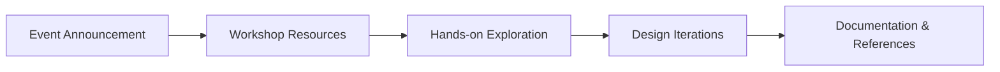

---

# ASME KLS-GIT's Events 

# ASMEKLSGIT Events

Technical events, engineering workshops, and design explorations conducted by the ASME Student Section at KLS GIT.
---

## About

This repository serves as a centralized directory for technical events conducted within the ASME Student Section.

Each event directory is intended to preserve:
- workshop material
- engineering workflows
- references and tutorials
- design examples
- event-specific documentation

The goal is to encourage experimentation, collaborative learning, and continued technical exploration beyond individual sessions and workshops.

---
## Workflow Overview 

    
## Current Event Directories

| Directory | Focus | Status |
|---|---|---|
| PCB-Design | PCB workflows, schematic design, EasyEDA | Active |
| CAD-Modelling | CAD modelling workflows and exercises | Active |

---

